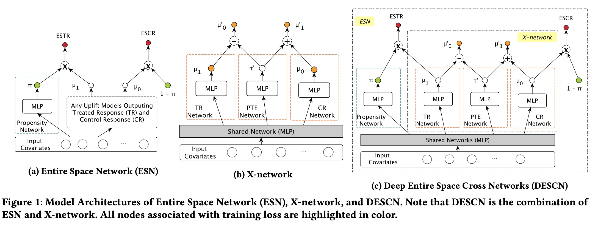

## README Language

- en [English](README.md)
- zh_CN [简体中文](readme/README.zh_CN.md)


## DESCN
Implementation of paper [DESCN: Deep Entire Space Cross Networks for Individual Treatment Effect Estimation](https://arxiv.org/abs/2207.09920), which is accepted in [SIGKDD 2022](https://kdd.org/kdd2022/) Applied Data Science Track.

#### Related concepts
- **Treatment effect**: the term refers to the causal effect of a binary (0–1) variable on an
outcome variable of scientific or policy interest.
- **Control group**: without treatment
- **Treatment group**: with treatment
- **The counterfactual**: we can not observe both treated and control responses in the exact same context


This paper proposes Deep Entire Space Cross Networks (DESCN) to model treatment effects from an end-to-end perspective. 
DESCN captures the integrated information of the treatment propensity, 
the response, and the hidden treatment effect through a cross network in a multi-task learning manner. 



## Reproduce the experimental results
The execution process and results can be viewed in  [DeepModels_real_data.ipynb](DeepModels_real_data.ipynb) which contains the code for converting dataset from `.csv` format to `.npz` format. 
    
All experiments uses GPU for training and `CUDA Verson:11.4`
## Code usage
`main.py`: main process for all models, except X-learner.   
The codes determines whether to enable sub-loss by setting the weight to 0 or not. Different models will enable different sub-loss.

`x_learner_main.py`: main process for X-learner(NN based).  
`eval4real_data.py`: evaluation process for LAZADA real dataset.  
`eval.py`: evaluation process for ACIC2019 dataset.  
`search_parames.py`: A serial scheduling tool, which can specify the model hyper-parameter file, evaluation code, dataset through the command line, and conveniently complete the whole process.  

A convenient way to call training and evaluation code serially:\
```python search_params.py main.py eval4real_data.py  ./conf4models/lzd_real_data/DESCN.txt 1 {path_to_train_npz} {path_to_test_npz}```\
More examples can be referred to code in  [DeepModels_real_data.ipynb](DeepModels_real_data.ipynb)


## Configuration
All models's hyper-parameters are saved in [./conf4models](conf4models).

NOTE:
>- All **path related configuration options** must be set an absolute path.
>- `./results/lzd_real` and `./runs` should be created. 

## Dataset
`./data` contain [the real-world Production Dataset from E-commerce platform Lazada.](data)

## Python packages version
- python == 3.7

other python packages version are showed in `requirements.txt`.


